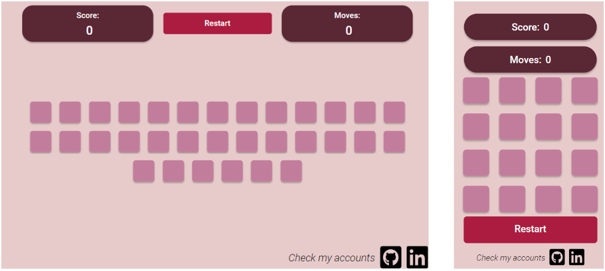
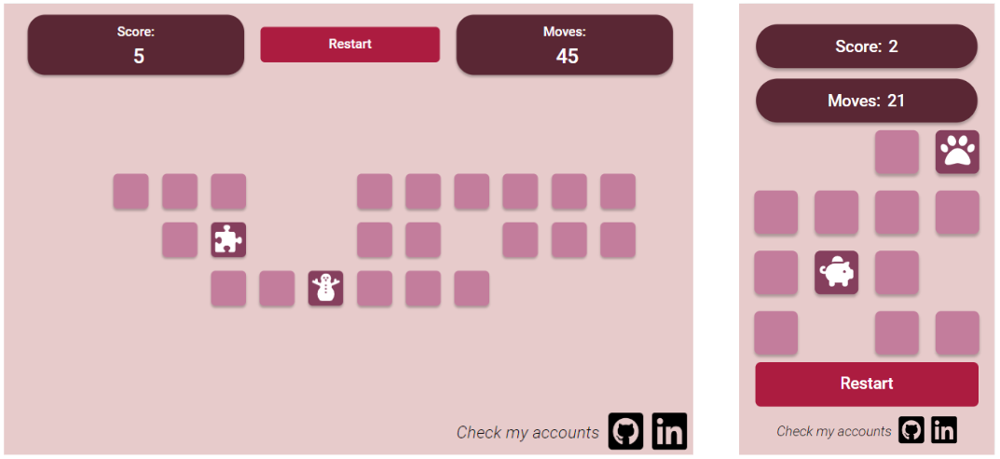
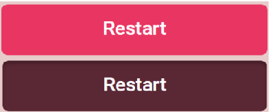

# Memory Game

A web-based application that allows users to exercise their memory.

## Description

The application consists of several elements. At the top of the page, tables are displayed showing the score and the number of moves made.  When the application is running on a laptop, for example, there is also a reset button at the top of the page, which allows you to reset the game and start over. In the center are the blocks. Each of them is the same size and color. Depending on the size of the screen on which the game is displayed, either 16 or 32 elements are generated. By clicking on one block, it automatically flips over showing a random picture. If the next block you click on hides the same icon underneath, both blocks disappear, and the number of points increases by one. If, on the other hand, the icons are different, the blocks flip over, thus covering the icons. The game is to pair all the blocks with the least number of moves.
The icons are chosen from the 30 available. Each refresh or reset of the page generates a new set of icons.
At the bottom of the page are references to the author's accounts. If the application is running at a lower screen resolution than 600 pixels, a reset button is also at the bottom of the page.

## Features

* Each move by the user is counted, and the current number of moves is displayed at the top of the page.
* The number of correctly reversed blocks is also counted and displayed.
* The reset button changes its appearance when you hover over it or click on it. It allows you to reload the game.
* The number of blocks depends on the width of the screen on which the page is turned on. When the width is greater than 600, then 32 blocks are generated. Otherwise - 16.
* After clicking on the block, a white icon appears. The color of the clicked block also changes.
* When two blocks are clicked, the user has 2 seconds to register the icon shown.
* Icons are randomized from 30 available icons every time the page is reset/refreshed.
* When you click on the graphics at the bottom of the page, the author's account opens in a new tab.

##  Application layout

* Below are screenshots showing how the application looks depending on the width of the screen.

* During the game.

* Changing the appearance of the 'Restart' button.

